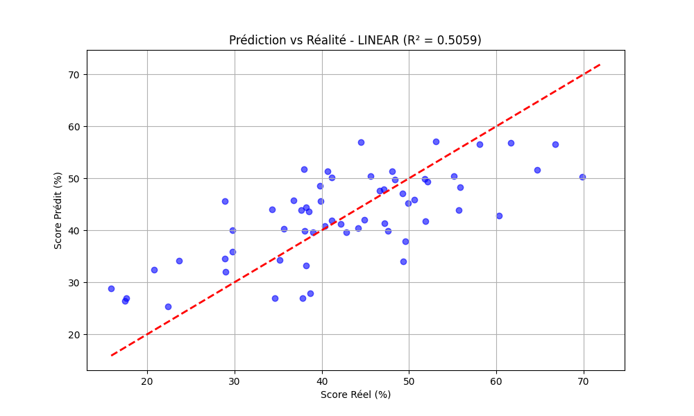
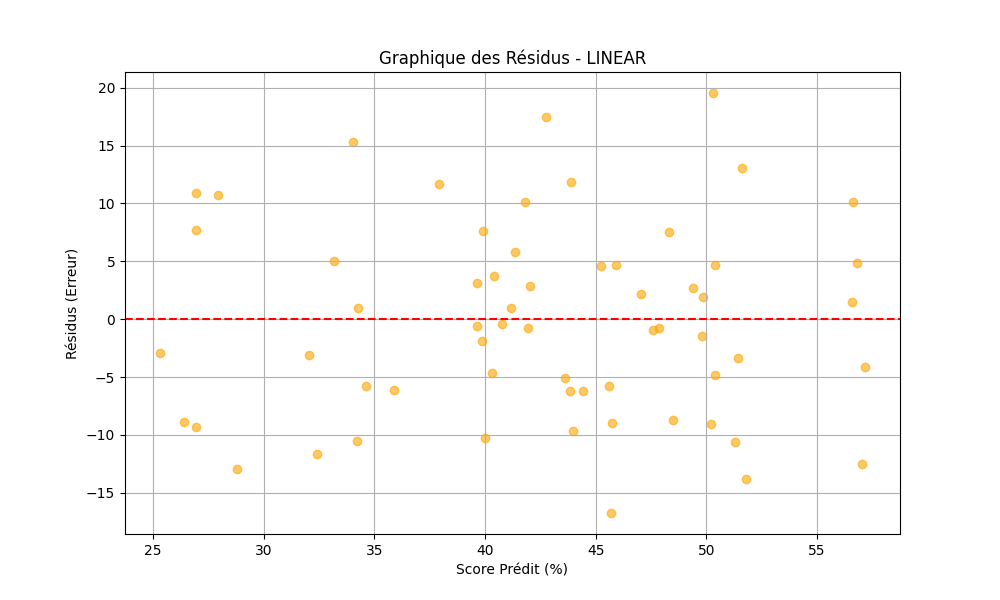
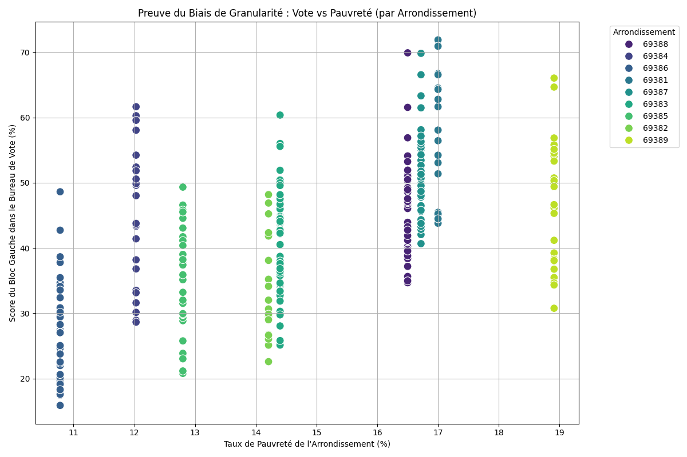
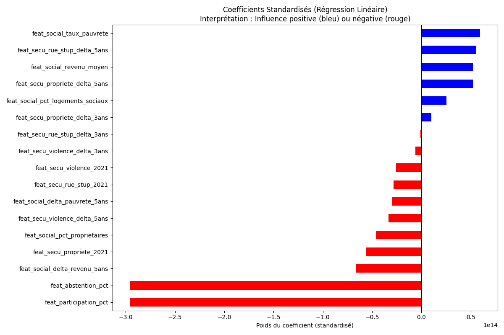

# 📝 Résumé Exécutif de la Modélisation (Baseline)

Ce document synthétise les résultats de notre première phase d'expérimentation en Machine Learning (Baseline). L'objectif est de présenter, en toute transparence, les performances actuelles du modèle et de diagnostiquer techniquement la cause de ses limites pour justifier nos prochaines décisions d'architecture de données.

---

## 1. Contexte : L'agrégation des données

Pour entraîner notre modèle de prédiction du score du "Bloc Gauche" au Tour 1, nous avons construit une **One Big Table (OBT)**.
Afin d'intégrer les indicateurs sociologiques (Filosofi) et sécuritaires (SSMSI), nous avons fait le choix initial d'agréger ces caractéristiques au niveau de l'**Arrondissement** (maille géographique plus large que le **Bureau de Vote**).

Chaque bureau de vote s'est donc vu attribuer le profil moyen de son arrondissement de rattachement.

---

## 2. Le Benchmark des Modèles

Nous avons comparé deux algorithmes :

- Un algorithme linéaire : **Régression Linéaire Multiple**
- Un algorithme non-linéaire basé sur les arbres de décision : **Forêt Aléatoire (Random Forest)**

### Les Performances par Blocs Politiques (Tour 1)

Voici les résultats de notre **Baseline v1 (Régression Linéaire)** pour chaque camp politique. Ces scores nous permettent de voir quels électorats sont les plus "prévisibles" par les variables socio-économiques.

| Bloc Politique | Précision ($R^2$) | Marge d'erreur (RMSE) | Erreur moyenne (MAE) |
| :--- | :--- | :--- | :--- |
| **CENTRE** | **0.59** | 4.9 pts | 3.9 pts |
| **DROITE** | **0.52** | 2.1 pts | 1.6 pts |
| **EXTREME_DROITE** | **0.51** | 3.9 pts | 3.1 pts |
| **GAUCHE** | **0.51** | 8.3 pts | 6.9 pts |
| **EXTREME_GAUCHE** | **0.51** | 0.4 pts | 0.3 pts |

> 💡 **Observation Clé :** Le vote pour le **Bloc Centre (Majorité)** est le mieux capté (59%). C'est un vote très corrélé au revenu et à la sociologie urbaine. Pour la **Gauche**, l'erreur (RMSE 8.3) est plus élevée, ce qui confirme que l'arrondissement est une maille trop large pour capter les poches de vote populaire très localisées.

### Comparaison des Algorithmes

Nous avons également benchmarké le comportement des algorithmes sur le bloc test :

- **Régression Linéaire : $R^2 = 0.51$** (Moyenne sur les blocs)
- **Random Forest : $R^2 = 0.33$**

> 💡 **Pourquoi le Random Forest "échoue"-t-il ?**
> Il montre que le modèle ne parvient pas à extraire de règles de décision robustes à partir de données trop agrégées. Les arbres de décision ont besoin de **variance** pour séparer les profils. Sans nuances claires entre les données (*puisque tous les bureaux d'un arrondissement ont le même profil*), l'algorithme "s'emmêle les pinceaux".

---

## 3. Le Diagnostic Visuel (Preuves à l'appui)

Les graphiques suivants illustrent mathématiquement le "plafond de verre" de notre approche actuelle.

### A. Graphique "Prédiction vs Réalité"

Ce graphique montre la justesse globale de notre modèle linéaire. La ligne rouge pointillée représente la prédiction parfaite.

**Analyse :** Le nuage suit bien la diagonale, validant la pertinence de nos choix de variables d'entrée. Toutefois, le nuage reste "épais" (marge d'erreur RMSE de 8 points) et le modèle tend à sous-estimer les résultats extrêmes (scores très élevés ou très faibles). Il manque un niveau de précision local.

### B. Le "Scanner" du Modèle : Graphique des Résidus

Le résidu est la différence entre la prédiction et la réalité. L'objectif d'un bon modèle est d'avoir des résidus répartis de manière aléatoire (un nuage homogène autour de zéro), ce qu'on appelle l'**homoscédasticité**.

**Analyse :** Les erreurs sont globalement centrées sur zéro, ce qui prouve l'absence de biais majeur (le modèle ne favorise systématiquement ni la gauche ni la droite). En revanche, la dispersion (de -15 points à +20 points) est la trace visuelle qu'une information essentielle "échappe" au modèle : la sociologie précise du quartier, que la moyenne de l'arrondissement a lissée.

### C. La Preuve Irréfutable : Le Biais de Granularité

Ce graphique superpose le Taux de pauvreté (Axe X) au Vote (Axe Y). Chaque point est un bureau de vote, coloré par arrondissement.

**Analyse :** Nous observons 9 colonnes verticales parfaites. Chaque colonne correspond à un arrondissement. Cette représentation visuelle confirme notre **biais sociologique** : en forçant le modèle à regarder une moyenne (par exemple, 14% de pauvreté pour tout l'arrondissement vert), on l'aveugle sur la diversité des quartiers qui votent pourtant de 20% à 60% à gauche. Le modèle est contraint de "couper la poire en deux".

### D. Le Levier d'Action : L'Importance des Variables (Coefficients)

Pour comprendre ce que le modèle arrive tout de même à déchiffrer, nous avons **standardisé** nos données pour pouvoir comparer les coefficients de la régression linéaire à échelle égale.

**Analyse :** La standardisation nous permet de prouver que la dynamique de la violence sur 5 ans ou la participation sont des variables extrêmement discriminantes, au-delà du seul revenu moyen lissé.

---

## 🚀 Conclusion et Plan d'Action

Les deux premiers graphiques se rejoignent et confirment bien \*_que notre erreur de prédiction (*les résidus épais*) est directement causée par notre perte d'information géographique (\_le biais de granularité illustré plus haut_).

L'algorithme n'est pas fautif : c'est notre signal d'entrée qui manque de **pouvoir discriminant**. En agrégeant par arrondissement, nous avons "lissé" la donnée et perdu la **variance locale** qui permet de différencier des quartiers socio-économiquement opposés (\_ex: Mermoz vs Monplaisir dans le 8ème arrondissement\*).

**Stratégie Corrective (Objectif R² > 0.60) :**
Nous devons refactoriser notre Data Pipeline Gold. Il est impératif d'abandonner l'arrondissement pour opérer une **jointure spatiale** au niveau des carreaux Insee (_maille de 200m_). Chaque bureau de vote héritera ainsi de sa véritable identité sociologique, ce qui restaurera la variance nécessaire à nos algorithmes.
